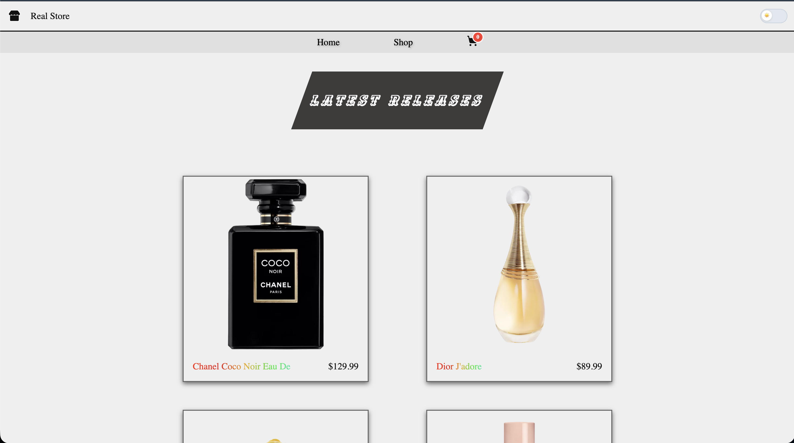

# Shopping Cart App

Browse. Filter. Add to cart. You know the drill.

---

## Live Demo

[Live Dem](https://realstore-tau.vercel.app/)

---

## Preview



---

## What it does

- gives product categories to browse
- Filter by category, sort by price
- Add to cart with custom quantity
- Cart state shared across pages via outlet context and thorugh props for the Cart Modal.
- Light / Dark mode
- Fully responsive

---

## Stack

| Tech            | Why                            |
| --------------- | ------------------------------ |
| React           | obviously                      |
| React Router v7 | nested routes + outlet context |
| CSS Modules     | scoped styles, no conflicts    |
| Vite            | fast                           |
| DummyJSON       | free mock API                  |

---

## Run it locally

```bash
git clone https://github.com/Shriyashzzz/shoppingCart.git
cd shoppingCart
npm install
npm run dev
```

---

## What I actually learned

- I tested some implementation using react testing library using vitetst
- Routing betweens react-routing library to Implement this project as SPA
- Switched from styled-components library to CS Modules with performence in mind. CSS modules allow chaching & makes initial loading faster.
- Custom hooks with `AbortController` cleanup
- Rules of Hooks the hard way (hooks after early returns 💀)
- CSS nesting is case-sensitive on Linux but not macOS, will be more careful when in dev mode(never again do I want to experience annyoying production issues)
- `FormData` API for form inputs
- Learned how to architect React app. (not the best rn still learning)
- Outlet context for shared cart state across routes
- Practiced fetching with Abort controller that aborts the fetching in case app rerenders while ferching data.
- Using global css to share css variables all around the App children.

---

## What's next

- Persist cart to `localStorage`
- Checkout flow
- Product detail pages
- Tests
- I'd like to practice parallel fetching, couldn't do so with this app, as i opted chace the fetched data, unless absolute necessary to fetch again.
- Looking forward to refactor code to use data-providers to share fetched data in between SHOP and HOME page to reduce unecessary fetching.

---

## Credits

- [The Odin Project](https://www.theodinproject.com/)
- [DummyJSON](https://dummyjson.com/)

---

_Educational / portfolio project._
